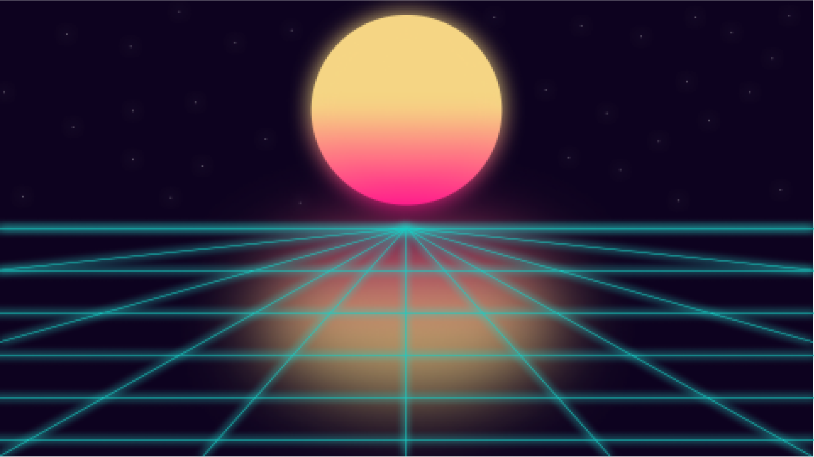

# SYNTH.

SYNTH. started out as a playground for testing color palettes and experimenting with JavaScript scroll animations. I enjoyed the cyberpunk palette I picked out so much that I turned it into a landing page of sorts.

Live Site: https://synth-wav.netlify.app/

## This project was created with HTML, CSS, and Vanilla JavaScript.

### Animations were made possible with ScrollMagic and GSAP.
